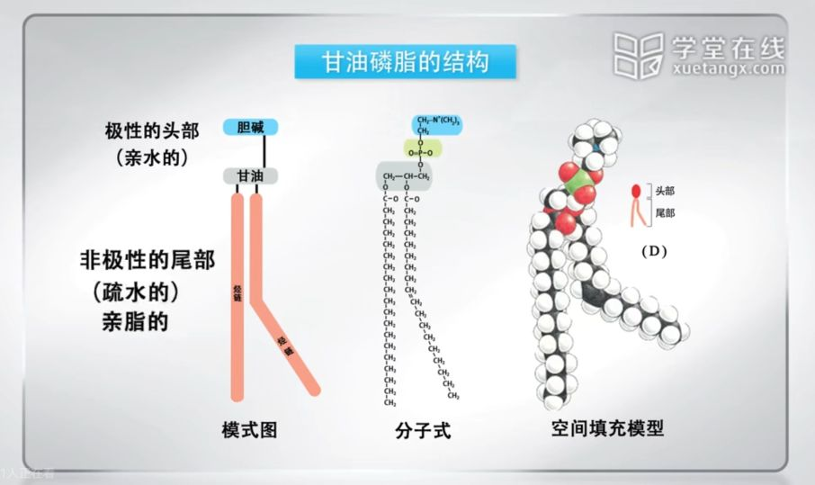
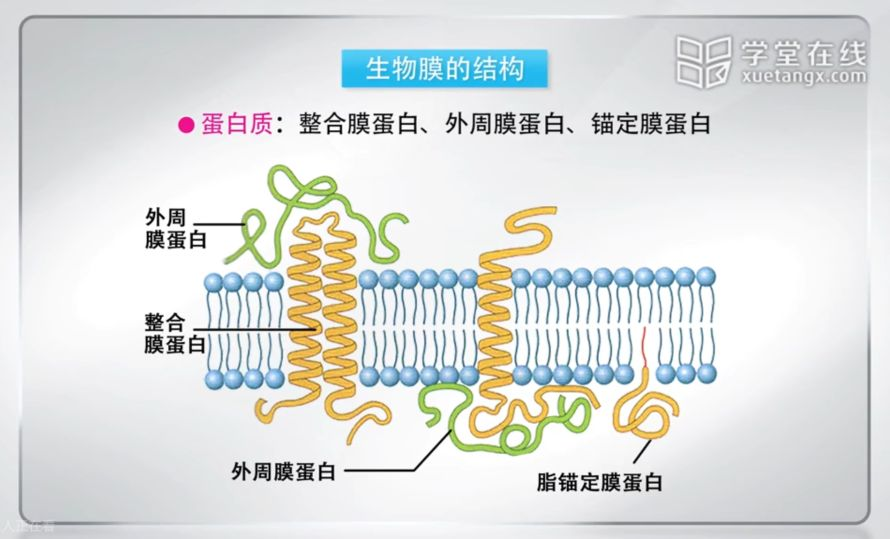
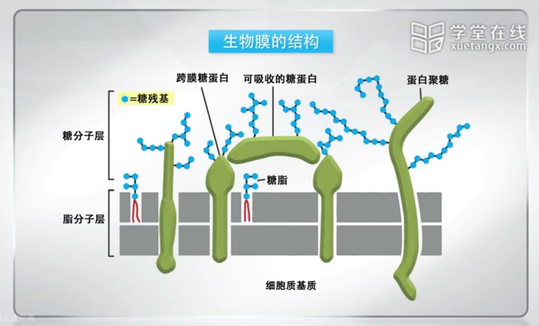

# 2.1
## 原核生物的主要代表

细菌、衣原体、支原体、立克次氏体、放线菌、蓝绿细菌（藻）等。

## 古细菌与真细菌

古细菌包括

  - 产甲烷菌
  - 嗜热酸菌
  - 嗜盐菌
  - 硫氧化菌
  - 等等……

除了上述特殊的古细菌外，其他**原核生物**被称为**真细菌**

# 2.2
## 生物膜

- **膜蛋白分布具有不对称性**
- 在细胞生长和分裂等各个生命过程中，生物膜处于**动态变化**中。

### 组成
#### 脂类

- 甘油磷脂
- 鞘脂
- 固醇

##### 基本成分：甘油磷脂（占整个膜脂的50%以上）

包括：

  - 磷脂酰胆碱（卵磷脂）
  - 磷脂酰丝氨酸
  - 磷脂酰乙醇胺
  - 磷脂酰肌醇

主要由**内质网**合成

#### 蛋白质

- 具有酶的功能
- 糖蛋白的糖链可以作为细胞之间的识别标识
- 形成细胞之间的连接
- 作为细胞骨架的附着点

#### 糖类

仅存在于细胞脂膜的外侧，与细胞脂接触的一侧是没有糖的。

ABO 血型的差异就是血细胞表面糖链的差异。

### 流动性

生物膜流动的速度：2μm/s

膜蛋白也具有流动性。
膜蛋白扩散速率：$5 \times 10^{-11} \sim 5 \times 10^{-9} cm^{2}/s$

#### 膜脂流动性影响因素

- 脂肪酸链的长度（越短越好）
- 不饱和脂肪酸含量（越高越大）
- 温度   - 不同膜脂的**变相温度**是不同的
- 胆固醇 - 对动物细胞膜的流动性起双向调节的作用
- 膜脂之间以及膜脂与膜蛋白之间的相互作用

#### 膜蛋白流动性测算办法

荧光漂白恢复技术（FRAP）

### 不对称性
#### 膜脂的不对称性

- 膜脂分子在膜的脂双层中不均匀分布
  - 磷脂：内外层种类和数量不均匀分布
  - 糖脂：位于细胞外侧

#### 膜蛋白的不对称性

- 膜蛋白在质膜上有明确的方向性
- 膜蛋白分布的不对称性是生物膜执行各种复杂技能的保证

### 细胞质膜的功能

细胞质膜(plasma membrane) 曾称细胞膜（cell membrane），是指包围在细胞表面的一层极薄的膜，主要由膜脂和膜蛋白所组成。细胞质膜的基本作用是维护细胞内微环境的相对稳定，并参与同外界环境进行物质交换、能量和信息传递。另外， 在细胞的生存、生长、分裂、分化中起重要作用。

- 提供相对稳定的内环境
- 选择性的物质运输
- 提供细胞识别的位点
- 为多种酶提供结合位点
- 介导细胞与细胞，细胞与胞外基质之间的联系
- 参与形成具有不同功能的细胞表面特化的结构
