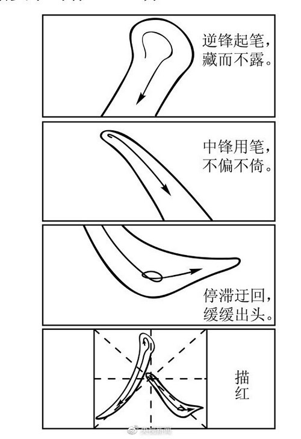

---
title: 作文标题
author: 
 - Yan
keywords:
 - 作文
 - 语文
date: 2022-01-24
...

# 原题
### 2021 全国Ⅰ卷
* 中国共产党走过百年历程。在党团结带领人民进行的伟大斗争中孕育的革命文化和社会主义先进文化，已经深深融入我们的血脉和灵魂。我们过的节日如“五四”“七一”“八一”“十一”，我们唱的歌曲如《义勇军进行曲》《没有共产党就没有新中国》，我们读的作品如《为人民服务》《沁园春·雪》《荷花淀》《红岩》，我们景仰的革命烈士如李大钊、夏明翰、方志敏、杨靖宇，我们学习的榜祥如雷锋、焦裕禄、钱学森、黄大年，等等，都给予我们精神的滋养和激励。我们心中有阳光，我们脚下有力量。我们的未来将融汇于中华民族伟大复兴的新征程，我们处在一个大有可为的时代……
* 请结合材料，以“可为与有为”为主题，写篇文章。
* 要求：选准角度，确定立意，明确文体，自拟标题；不要套作，不得抄袭；不得泄露个人信息；不少于800字。

### 2021 新高考Ⅰ卷
* 1917年4月，毛泽东在《新青年》发表《体育之研究》一文，其中论及“体育之效”时指出：人的身体会天天变化。目不明可以明，耳不聪可以聪。生而强者如果滥用其强，即使是至强者，最终也许会转为至弱；而弱者如果勤自锻炼，增益其所不能，久之也会变而为强。因此，“生而强者不必自喜也，生而弱者不必自悲也。吾生而弱乎，或者天之诱我以至于强，未可知也”。 
* 以上论述具有启示意义。请结合材料写一篇文章，体现你的感悟与思考。 
* 要求：选准角度，确定立意，明确文体，自拟标题：不要套作，不得抄袭；不得泄露个人信息；不少于800字。

### 2021 新高考Ⅱ卷

* $[注]描红：用毛笔蘸墨在红模子上描着写字。$
* 请整体把握漫画的内容和寓意写一篇文章，反映你的认识与评价、鉴别与取舍，体现新时代青年的思考。
这个已经审题过

### 2020 全国Ⅰ卷
* 春秋时期，齐国的*公子纠*与*公子小白*争夺君位，*管仲*和*鲍叔*分别辅助他们。
* **管仲**带兵阻击小白，用箭射中他的衣带钩，**小白装死逃脱**。后来小白即位为君，史称齐桓公。
* 鲍叔对桓公说，要想**成就霸~~王之~~业，非管仲不可**。于是桓公**重用管仲**，鲍叔**甘居其下**，终成一代霸业。
* ~~后人称颂齐桓公九合诸侯、一匡天下，为“春秋五霸”之首。~~
* 孔子说：“桓公九合诸侯，不以兵车，管仲之力也。”
翻译：齐桓公九合诸侯，是凭借管仲的能力，而不是军队。
* 司马迁说：“天下不多（称赞）**管仲**之贤而多**鲍叔**能知人也。” 
翻译：天下人都称赞管仲贤智，鲍叔识人。
* 班级计划举行**读书会**，围绕上述材料展开讨论。齐桓公、管仲和鲍叔三人，你对哪个感触**最**深？请结合你的感受和思考写一篇**发言稿**。 
* ~~要求：结合材料，选好角度，确定立意，明确文体，自拟标题；不要套作，不得抄袭；不得泄露个人信息；不少于800字。~~

鲍叔

+ 甘居其下
+ 慧眼识珠
+ 自知

管仲

- 才能出众
- 忠心耿耿

### 2019 全国Ⅰ卷
* “民生在勤，勤则不匮”，**劳动**是财富的源泉，也是幸福的源泉。
* “夙兴夜寐，洒扫庭内”，热爱劳动是中华民族的优秀**传统**，绵延至今。
* 可是现实生活中，也有一些同学**不理解劳动，不愿意劳动**。
* 有的说：“我们**学习**这么忙，劳动太占时间了！”
* 有的说：“**科技**进步这么快，劳动的事，以后可以交给人工智能啊！”
* 也有的说：“劳动这么苦，这么累，干吗非得自己干？**花点钱**让别人去做好了！”

金钱/**资本**

* 此外，我们身边也还有着一些不尊重劳动的现象。
* 这引起了人们的深思。
* 请结合材料内容，面向本校(统称“复兴中学”)同学写一篇**演讲稿**，倡议大家“热爱劳动，从我做起”，体现你的认识与思考，并提出希望与建议。
* ~~要求：自拟标题，自选角度，确定立意；不要套作，不得抄袭；不得泄露个人信息；不少于800字。~~

### 2019 全国Ⅱ卷
* 1919年，民族危亡之际，中国青年学生掀起了一场彻底反帝反封建的伟大爱国革命运动。1949年，中国人从此站立起来了！新中国青年投身于祖国建设的新征程。1979年，“科学的春天”生机勃勃，莘莘学子胸怀报国之志，汇入改革开放的时代洪流。2019年，青春中国凯歌前行，新时代青年奋勇接棒，宣誓“强国有我”。2049年，中华民族实现伟大复兴，中国青年接续奋斗……
* 请从下列任务中任选一个，以青年学生当事人的身份完成写作。
1. 1919年5月4日，在学生集会上的演讲稿。
2. 1949年10月1日，参加开国大典庆祝游行后写给家人的信。
3. 1979年9月15日，参加新生开学典礼后写给同学的信。
4. 2019年4月30日，收看“纪念五四运动100周年大会”后的观后感。
5. 2049年9月30日，写给某位“百年中国功勋人物”的国庆节慰问信。
* 要求：结合材料，自选角度，确定立意；切合身份，贴合背景；符合文体特征；不要套作，不得抄袭；不得泄露个人信息；不少于800字。

# 给出的例子

## 修辞

为了方便，我这里给些**套路化**的做法

### 把/用/以/ect

`就是 用/把/以/让/借/ect + *主题1* + 动词 + *主题2* + 名词`

而这里面的主题就是**审题**审出来的

要写好标题，关键字必须审题正确。

+ 把**红色文化**种子播种到**新青年**的心田中
+ 以**修己**之剑斩除**冷漠**阻碍
* 以**宽容**之舟抵达**崛起**彼岸
* 用**宽容**之犁开垦**和谐**之地
* 让**劳动**之火点燃**学习**热情
+ 用**改革**合力拉动**复兴**之梦
+ 让**劳动**基因转入**学生**思想
+ 用**改革**之笔绘制**复兴**蓝图
* 让**理智**之光驱散**贪欲**阴影
* 莫让**贪欲**阴影遮掩**理智**之光
* 借**梦想**之舟，度**寂寞**苦海

#### 金木水火土+学科

##### 金-金属
+ 剑
+ 犁
+ 车

##### 木
+ 种子
+ 叶子
+ 果实

##### 土
+ 心田
+ 堤岸

##### 火
* 火

##### 水
+ 甘露
+ 源泉

##### 书法
* 笔

##### 工程
* 蓝图

##### 数学
+ 坐标
+ 公式

##### 物理
+ 合力

##### 生物
+ 染色体
+ 基因

#### 运用判断句`是`
+ **劳动**是优秀传统
+ **痛苦**也是一种财富

#### 化用-考验基础
+ 众里寻它千百度
+ 曲径通幽处
+ 所谓伊人，在水一方
+ XX诚可贵，XX价更高。

#### 对偶/对仗

##### 并列
+ **创新**为火，**勉励**为柴
+ **疫考**过关，**汛考**加试

##### 对比
+ 脱下**旧黑衣**，换上**新绿装**

##### 递进
+ XX诚可贵，XX价更高。

以上这些都可以当作分论点用。因为本身是**论点式标题**

# 讲义
+ 论题式

论题的`题`是指，论述的问题。

+ 论点式

### 论题式标题
+ 论 xxx
+ 从 xxx 谈起
+ 浅谈 xxx
+ 中国人失掉自信力了吗
它们具有个特点，就是只能看出文章说了什么方面的东西
看不出作者具体的态度/观点

举个例子：`浅谈史记`
这个标题下面的文章，我们只能知道作者想说说`经典力学`，而不知道作者**是褒是贬**。

### 论点式标题

论点式标题，就是把`论点`写成标题

+ **生命**诚可贵
+ 把**红色文化**播种到**新青年**的心田中

多数人对于高中生写作文
推荐的是`论点式标题`
而这些标题也是更容易出色些，因为可以运用**修辞**手法。

